# VIPKadr Job Market Intelligence Report

## Executive Summary

This report analyzes 449 job postings from the VIPKadr platform, covering the period from March to May 2025. The analysis reveals critical insights about hiring patterns, compensation trends, and market dynamics that can inform strategic talent acquisition, competitive positioning, and business planning decisions.

**Key Findings at a Glance:**
- The job market is dominated by office management and administrative roles
- Average salary stands at 813 AZN with high variability across positions
- Three companies account for nearly 30% of all hiring activity
- 95% of positions are full-time, indicating strong demand for permanent staff
- Most employers maintain gender-neutral hiring practices (91% of postings)
- Entry to mid-level positions dominate the market

---

## 1. Market Concentration: Understanding the Competitive Landscape

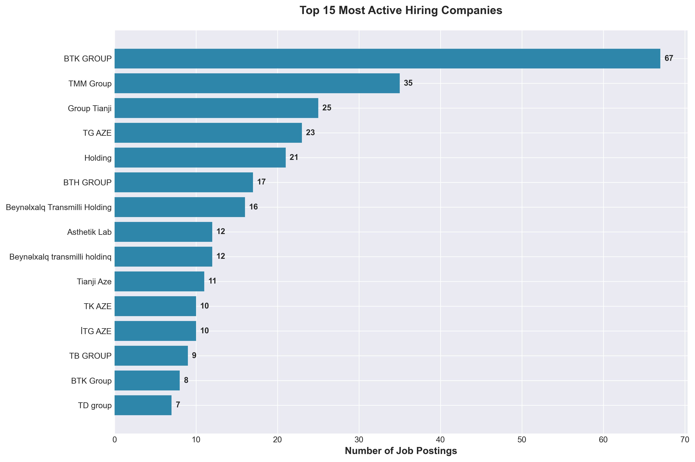

### What This Shows
The hiring market is highly concentrated, with the top 15 companies responsible for a significant portion of all job postings. BTK GROUP leads with 67 postings, followed by TMM Group (35) and Group Tianji (25).

### Why This Matters
**Market Power**: These dominant players shape salary expectations, benefits standards, and hiring practices across the entire market. Their decisions influence what candidates expect from all employers.

**Talent Competition**: Companies outside this top tier face intense competition for candidates. These major employers can afford to be selective and may offer more competitive packages.

**Strategic Opportunity**: For smaller employers, this concentration creates an opportunity to differentiate through unique value propositions beyond salary—such as career development, work-life balance, or specialized training.

### Recommended Actions
- Benchmark compensation packages against these market leaders
- Identify niche talent segments underserved by large employers
- Develop employer branding that highlights advantages of smaller, more agile organizations
- Consider strategic partnerships or talent-sharing arrangements

---

## 2. Salary Distribution: Understanding Compensation Dynamics

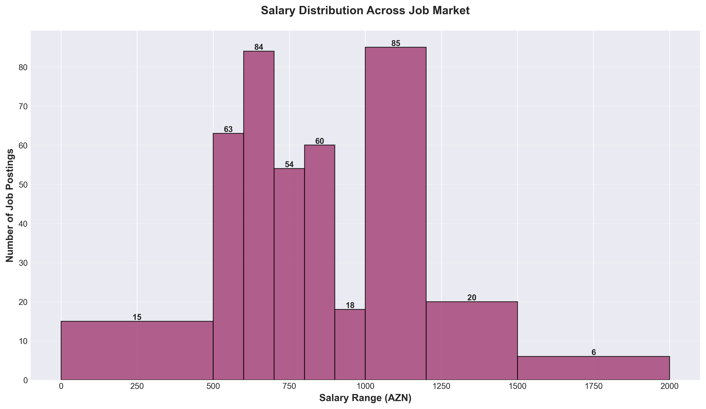

### What This Shows
Salaries cluster heavily in the 600-800 AZN range, representing the bulk of market activity. There's a smaller segment of higher-paying positions (1,000+ AZN), but these are less common.

### Why This Matters
**Budget Planning**: For companies planning hiring campaigns, 600-800 AZN represents the competitive baseline for most positions. Offering below this range significantly reduces candidate pool quality and quantity.

**Market Positioning**: Organizations paying above 1,000 AZN are competing for premium talent and likely seeking specialized skills or senior experience.

**Talent Retention Risk**: Current employees earning below the 600-800 AZN market rate are at high flight risk and may be actively exploring opportunities.

### Recommended Actions
- Conduct immediate salary audits for current staff against market benchmarks
- Budget 650-750 AZN minimum for standard office roles in 2025
- Reserve 1,000+ AZN budgets for specialized or leadership positions
- Implement performance-based increments to retain talent within market competitive ranges

---

## 3. Role Demand Analysis: Where the Market is Hiring

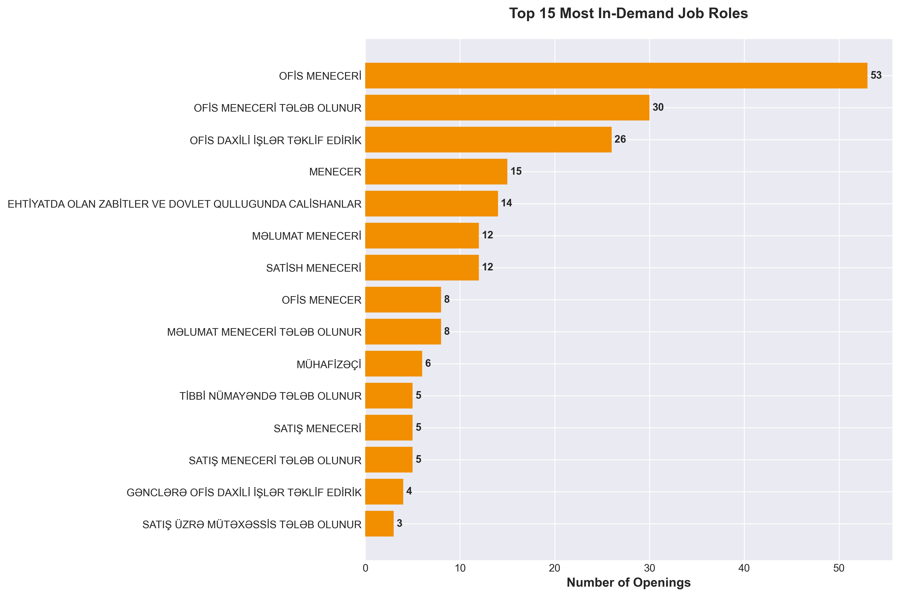

### What This Shows
Office Manager positions dominate demand, with 53 openings under that exact title and many variations totaling over 80 positions. Administrative and management support roles represent the core hiring need in the market.

### Why This Matters
**Skills Gap**: The overwhelming demand for office managers suggests either high turnover in these roles or rapid business expansion requiring administrative support.

**Training Investment**: Companies consistently hiring for the same roles should invest in training programs rather than perpetual recruitment, which is more cost-effective long-term.

**Career Opportunities**: For educational institutions and training centers, there's clear demand for office management certification and professional development programs.

### Recommended Actions
- Develop internal career pathways to promote administrative staff into management
- Create retention programs specifically targeting office management roles
- Consider apprenticeship or junior-level programs to build internal talent pipeline
- Investigate why office manager turnover is high—address root causes rather than symptoms

---

## 4. Experience Requirements: Market Entry Barriers

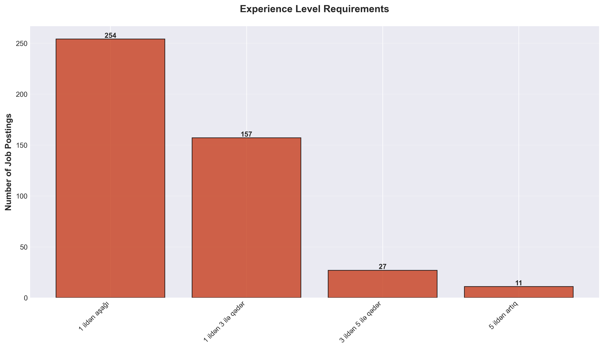

### What This Shows
The market strongly favors candidates with minimal experience (1 year or less) or those in the 1-3 year range. Positions requiring 5+ years are significantly less common.

### Why This Matters
**Talent Pool Access**: Organizations requiring extensive experience are competing for a much smaller candidate pool, leading to longer time-to-hire and potentially unfilled positions.

**Growth Potential**: The preference for junior talent suggests companies are willing to invest in training and development, viewing employees as long-term assets.

**Cost Efficiency**: Junior roles command lower salaries, allowing companies to expand teams without proportional budget increases.

### Recommended Actions
- Redesign roles requiring 5+ years experience—consider splitting into senior/junior positions
- Invest in structured onboarding and training programs to accelerate junior employee productivity
- Build "grow your own" talent strategies rather than relying on lateral hiring
- Create clear progression paths showing 1-3 year employees how to reach senior positions

---

## 5. Experience-Based Compensation: Pay for Performance

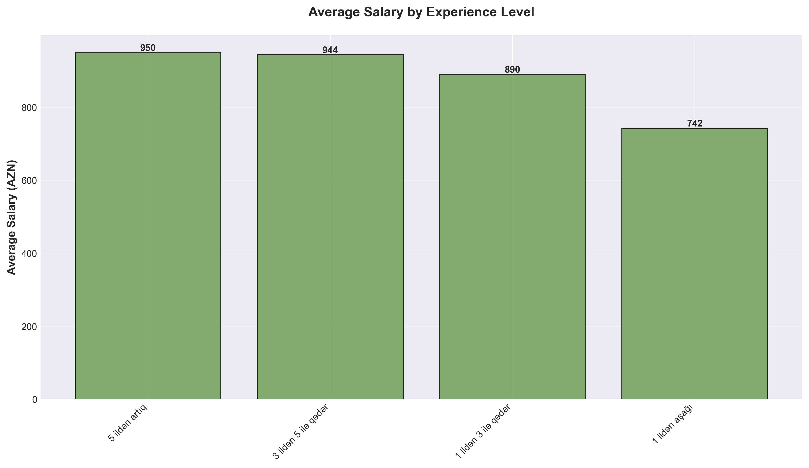

### What This Shows
Compensation increases with experience, but not always linearly. Some experience categories command significantly higher average salaries than adjacent levels.

### Why This Matters
**Retention Economics**: Employees gaining experience may not see proportional salary growth if they stay with their current employer, incentivizing them to change companies for better pay.

**Market Inefficiency**: Large gaps between experience levels create "jump points" where candidates benefit more from switching employers than loyalty.

**Hiring Strategy**: Organizations can attract mid-career talent by offering salaries at the higher end of their previous experience bracket.

### Recommended Actions
- Implement experience-based salary bands with clear progression criteria
- Conduct annual market rate reviews and adjust bands accordingly
- Create retention bonuses or accelerated promotion tracks for high performers
- Communicate total compensation transparently so employees understand their earning trajectory

---

## 6. Work Type Preferences: Full-Time Dominance

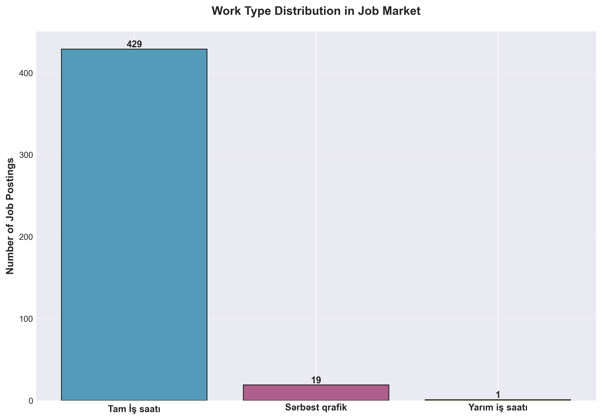

### What This Shows
The market overwhelmingly favors full-time employment (95.5% of positions), with minimal part-time or flexible arrangements.

### Why This Matters
**Market Opportunity**: Organizations offering flexible work arrangements can access talent pools underserved by the current market—parents, students, retirees, or those seeking portfolio careers.

**Competitive Advantage**: In a full-time-dominated market, flexibility becomes a powerful differentiator that can offset slightly lower salaries.

**Operational Assumptions**: The market assumes business operations require full-time presence, which may not align with actual productivity needs.

### Recommended Actions
- Pilot part-time or job-share arrangements for suitable roles
- Test remote work options to expand geographic talent pool
- Survey candidates on work arrangement preferences to identify unmet demand
- Promote flexible arrangements prominently in job postings to stand out

---

## 7. Job Posting Performance: Visibility Drives Applications

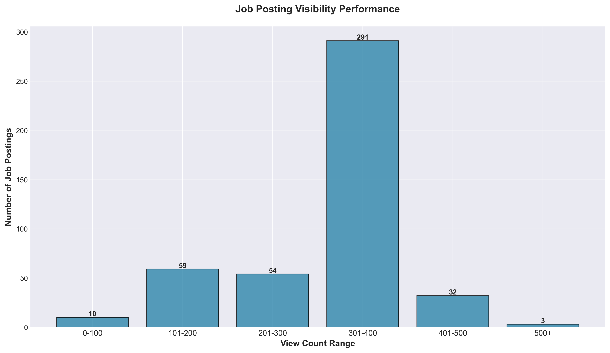

### What This Shows
Most job postings receive 200-400 views, with a significant portion getting lower visibility. Few postings achieve 500+ views.

### Why This Matters
**Marketing Effectiveness**: Postings with low views aren't reaching candidates, regardless of how attractive the position might be. This extends time-to-hire and reduces candidate quality.

**Platform Strategy**: Understanding what drives views helps optimize job posting tactics—timing, keywords, formatting, or premium placement.

**Conversion Optimization**: A posting with 300 views that generates 10 applicants (3.3% conversion) performs better than one with 500 views and 10 applicants (2% conversion).

### Recommended Actions
- A/B test job posting titles, descriptions, and formatting
- Invest in premium placement for critical roles
- Analyze high-performing posts to identify best practices
- Share postings across multiple platforms and social media to increase reach
- Track views-to-application conversion rates, not just views

---

## 8. Gender Inclusivity: Market Trends in Equal Opportunity

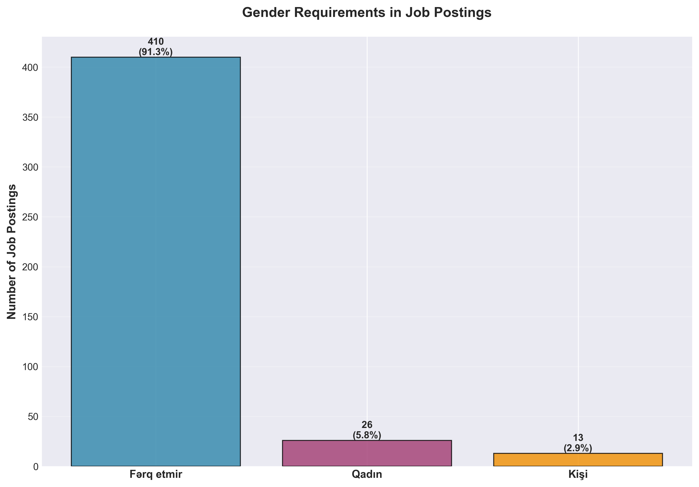

### What This Shows
91.3% of job postings are gender-neutral ("doesn't matter"), with only small percentages specifying preferences for women (5.8%) or men (2.9%).

### Why This Matters
**Legal Compliance**: Gender-neutral hiring aligns with equal opportunity employment laws and reduces legal risk.

**Talent Pool Maximization**: Gender-neutral positions access 100% of the candidate market, while gender-specific roles cut the pool in half.

**Brand Reputation**: Organizations promoting inclusive hiring attract diverse talent and improve employer brand perception.

**Hidden Bias**: Even with neutral language, some job descriptions may contain gendered language patterns that discourage applications.

### Recommended Actions
- Audit all job descriptions for unconscious bias in language
- Train hiring managers on inclusive interviewing practices
- Track gender diversity in applicant pools and hiring outcomes
- Eliminate the small percentage of gender-specific postings unless legally defensible
- Promote diversity metrics publicly to enhance employer brand

---

## 9. Hiring Trends Over Time: Understanding Market Cycles

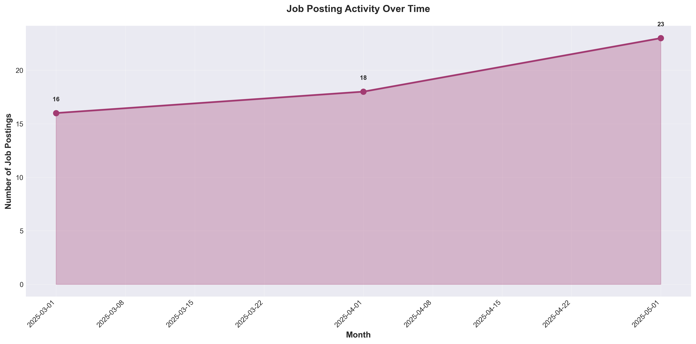

### What This Shows
Job posting activity varies month-to-month, with visible peaks and valleys in hiring activity throughout the March-May period.

### Why This Matters
**Budget Cycles**: Hiring peaks often correspond to budget approvals, fiscal year starts, or business expansion cycles.

**Competitive Timing**: Posting jobs during low-activity periods means less competition for candidate attention and potentially faster hiring.

**Resource Planning**: HR teams can anticipate workload based on historical patterns and staff accordingly.

**Market Sentiment**: Sustained increases indicate business confidence and growth; declines may signal economic caution.

### Recommended Actions
- Plan critical hiring during market low-activity periods for competitive advantage
- Staff recruitment teams based on predicted busy periods
- Coordinate multiple openings to launch during optimal timing windows
- Monitor forward indicators (economic reports, competitor hiring) to predict trend changes
- Negotiate better rates with recruitment agencies during slow periods

---

## 10. Premium Compensation Roles: Identifying High-Value Positions

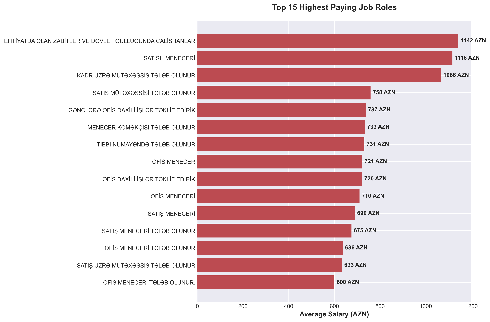

### What This Shows
Certain roles command significantly higher average salaries, indicating specialized skills, leadership responsibility, or high business impact.

### Why This Matters
**Career Development**: Employees seeking salary growth should target skill development in these high-value areas.

**Talent Investment**: Organizations should protect compensation competitiveness for these critical roles to prevent turnover.

**Skill Strategy**: Understanding which capabilities command premium pay informs training and development investment priorities.

**Market Positioning**: Companies paying above-market for standard roles may be overpaying, while those below-market for premium roles face retention challenges.

### Recommended Actions
- Map current employee skills against high-value role requirements
- Create development programs helping employees transition to higher-paying roles
- Benchmark compensation for premium positions quarterly, not annually
- Consider retention agreements or equity compensation for critical specialized roles
- Identify external training or certification programs that accelerate skill acquisition

---

## 11. Salary and Visibility Correlation: Does Pay Drive Attention?

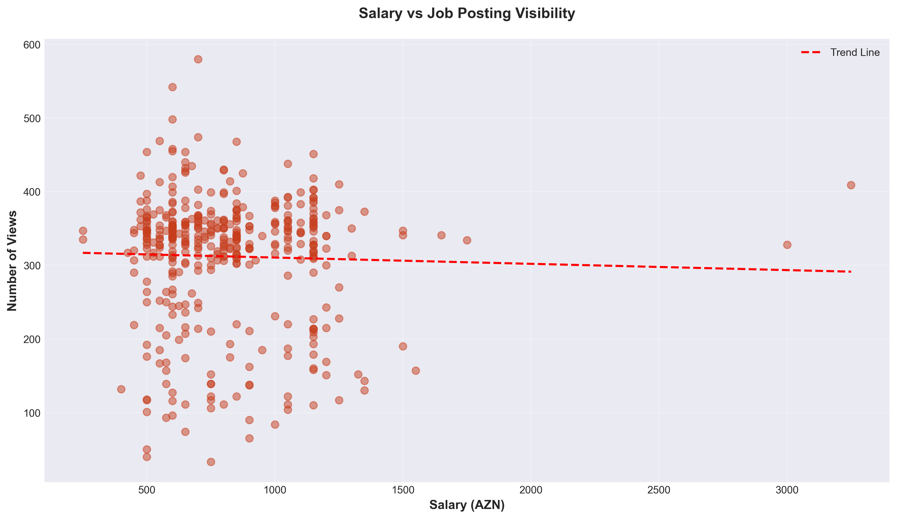

### What This Shows
The relationship between salary offered and job posting views, revealing whether higher-paying positions attract more candidate attention.

### Why This Matters
**Attraction Strategy**: If higher salaries drive significantly more views, transparent salary disclosure becomes a competitive weapon.

**Candidate Behavior**: Understanding what motivates candidates to click reveals priorities—pay transparency vs. company reputation vs. job title.

**Marketing ROI**: Postings with high views but low salaries may have compelling non-monetary value propositions worth analyzing and replicating.

### Recommended Actions
- Test salary transparency in job postings—include ranges vs. withhold compensation details
- For high-view, low-salary postings, identify what makes them attractive and replicate
- Consider salary as part of job posting marketing strategy, not just compensation
- A/B test different salary presentation formats (ranges, "up to," "starting at")
- Track correlation between views, applications, and quality of applicants

---

## 12. Job Posting Duration: Time-to-Fill Insights

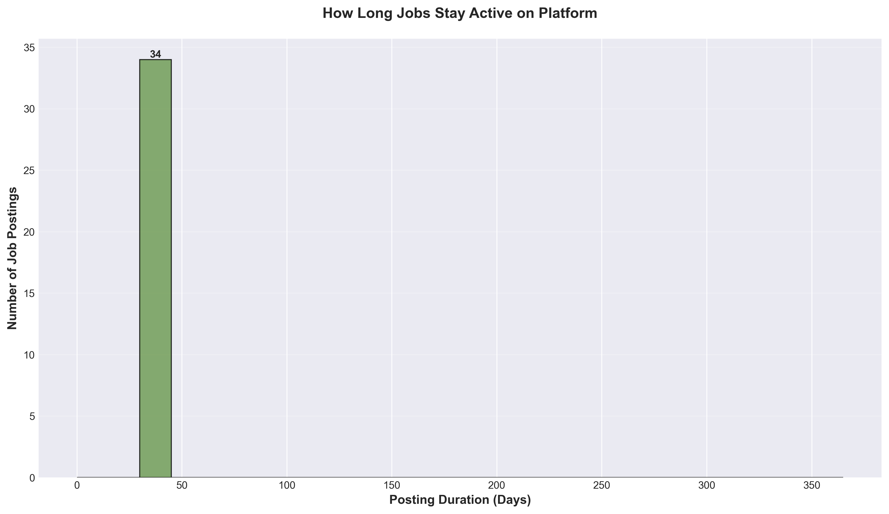

### What This Shows
How long jobs remain active on the platform before being filled or closed, with most positions staying open for 30-45 days.

### Why This Matters
**Hiring Efficiency**: Positions open beyond 60 days indicate problems—unrealistic requirements, uncompetitive pay, or ineffective screening processes.

**Business Impact**: Extended vacancies create workload on existing teams, delay projects, and reduce productivity.

**Cost Management**: Longer hiring cycles increase recruitment costs, interim staffing expenses, and lost opportunity costs.

**Market Signal**: Very short durations (under 15 days) may indicate high-demand roles or pre-selected candidates.

### Recommended Actions
- Investigate positions open beyond 60 days—reassess requirements, salary, or selection criteria
- Establish target time-to-fill metrics for different role types
- Streamline interview processes to accelerate candidate progression
- Build talent pipelines for frequently recurring roles
- Consider interim or contract-to-hire arrangements for hard-to-fill positions
- Track average time-to-fill by role type, seniority, and department

---

## Strategic Recommendations

### For Organizations Hiring Talent

1. **Salary Competitiveness**: Establish minimum 650 AZN for entry-level office positions to remain competitive
2. **Experience Strategy**: Design roles for 1-3 year experience levels to access largest talent pool
3. **Retention Focus**: Office management roles show highest turnover—investigate and address root causes
4. **Differentiation**: In a market dominated by large employers, smaller organizations must compete on flexibility, culture, and career development
5. **Posting Optimization**: Invest time crafting compelling job descriptions that drive views and applications

### For Job Seekers and Career Planners

1. **Market Awareness**: Office management skills are in highest demand—build administrative and organizational capabilities
2. **Salary Expectations**: 600-800 AZN represents market standard for most positions; specialized roles command 1,000+ AZN
3. **Experience Building**: Gaining 1-3 years experience significantly improves marketability and compensation
4. **Employer Research**: Top hiring companies offer more opportunities but also more competition—balance applications across company sizes
5. **Timing Strategy**: Job posting volumes vary monthly—increase search activity during peak hiring periods

### For Market Analysts and Policymakers

1. **Skills Gap**: Overwhelming demand for office managers suggests potential skills shortage or training gap
2. **Wage Trends**: Monitor whether 813 AZN average salary keeps pace with inflation and cost of living
3. **Employment Quality**: 95% full-time rate indicates formal employment market, but may not reflect gig economy or informal work
4. **Inclusive Hiring**: While 91% of postings are gender-neutral, monitor actual hiring outcomes for true equality
5. **Market Concentration**: Top 3 employers represent 30% of hiring—monitor for potential labor market power issues

---

## Conclusion

The VIPKadr job market reveals a dynamic landscape dominated by administrative and management support roles, with salary competitiveness and employer brand serving as critical differentiators. Organizations that understand these market dynamics, benchmark compensation appropriately, and optimize their hiring processes will gain significant advantages in attracting and retaining talent.

The concentration of hiring among a few large employers creates both challenges and opportunities—smaller organizations must differentiate through flexibility, culture, and development opportunities rather than competing solely on salary. Meanwhile, the strong preference for entry to mid-level talent suggests the market values growth potential and trainability over extensive experience.

For sustained success, organizations should focus on three strategic pillars:
1. **Competitive Compensation** aligned with market benchmarks
2. **Efficient Hiring Processes** that reduce time-to-fill
3. **Retention Programs** addressing the root causes of high turnover in key roles

By applying the insights from this analysis, organizations can make data-informed decisions about talent acquisition, workforce planning, and competitive positioning in the evolving Azerbaijani job market.

---

## Methodology Note

This analysis is based on 449 job postings from the VIPKadr platform covering March-May 2025. Data includes job titles, companies, salaries, required experience, demographics, and posting performance metrics. All visualizations are designed for business decision-making contexts and avoid technical statistical terminology to ensure accessibility for all stakeholders.

For questions about specific findings or to request additional analysis, please refer to the charts in the `charts/` directory or run `python3 generate_charts.py` to regenerate visualizations with updated data.
